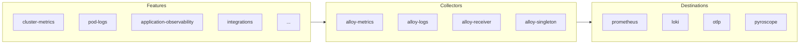

<!--
(NOTE: Do not edit AGENTS.md directly. It is a generated file!)
(      To make changes, please modify AGENTS.md.gotmpl and run `make build`)
-->

# k8s-monitoring Helm Chart - AI Assistant Guide

This file helps AI assistants understand and navigate the k8s-monitoring Helm chart.
**Always check this chart's documentation before searching externally.** Many configurations
exist in this helm chart and subcharts to handle common scenarios.

## Chart Architecture



Features generate telemetry data, which flows through Collectors (Grafana Alloy instances),
and is sent to Destinations (Prometheus, Loki, Tempo, Pyroscope, or any OTLP endpoint).

## Primary Entry Points

Always check these files first:

| File | Purpose |
|------|---------|
| `values.yaml` | Main configuration file with all options |
| `README.md` | Chart overview, quick start, and values reference |
| `docs/Structure.md` | Architecture explanation |
| `docs/Features.md` | Feature comparison table |
| `docs/Migration.md` | Upgrading from v1 |

## Discovery Patterns

### Features

**Location:** `charts/feature-*/`

Each feature follows a consistent structure:

```text
charts/feature-{name}/
├── Chart.yaml           # Feature metadata and version
├── values.yaml          # Configuration options
├── README.md            # Usage documentation
└── templates/
    ├── _module.alloy.tpl    # Alloy configuration
    └── _notes.tpl           # Deployment notes
```

**Available features** (auto-generated from `charts/feature-*/Chart.yaml`):

<!-- BEGIN FEATURES -->

-   `feature-annotation-autodiscovery` - Gathers metrics automatically based on Kubernetes Pod and Service annotations
-   `feature-profiling` - Gathers profiles from eBPF, Java, and pprof sources.
-   `feature-cluster-events` - Gathers Kubernetes Events
-   `feature-pod-logs-via-kubernetes-api` - Kubernetes Observability feature for gathering Pod logs by streaming them from the Kubernetes API.
-   `feature-pod-logs` - Kubernetes Observability feature for gathering Pod logs.
-   `feature-node-logs` - Kubernetes Observability feature for gathering Cluster Node logs.
-   `feature-auto-instrumentation` - Gathers telemetry data via automatic instrumentation
-   `feature-cluster-metrics` - Gathers Kubernetes Cluster metrics
-   `feature-integrations` - Service integrations
-   `feature-profiles-receiver` - Kubernetes Observability feature for receiving profiles.
-   `feature-application-observability` - Gathers application data
-   `feature-prometheus-operator-objects` - Gathers metrics using Prometheus Operator Objects
<!-- END FEATURES -->

**Enable a feature:**

```yaml
clusterMetrics:
  enabled: true

podLogs:
  enabled: true
```

### Destinations

**Values:** `destinations/{type}-values.yaml`
**Docs:** `docs/destinations/{type}.md`

**Available destination types** (auto-generated from `destinations/*-values.yaml`):

<!-- BEGIN DESTINATIONS -->

-   `custom` - Custom destination configuration
-   `loki-stdout` - Send logs to stdout (debugging)
-   `loki` - Send logs to Loki
-   `otlp` - Send to any OTLP endpoint (Tempo, Grafana Cloud, etc.)
-   `prometheus` - Remote write to Prometheus-compatible endpoint
-   `pyroscope` - Send profiles to Pyroscope
<!-- END DESTINATIONS -->

**Configure a destination:**

```yaml
destinations:
  - name: grafanaCloud
    type: otlp
    url: https://otlp-gateway-prod-us-central-0.grafana.net/otlp
    auth:
      type: basic
      username: "<instance_id>"
      password: "<cloud_api_key>"
```

### Integrations

**Values:** `charts/feature-integrations/integrations/{name}-values.yaml`
**Docs:** `charts/feature-integrations/docs/integrations/{name}.md`

**Available integrations** (auto-generated from `charts/feature-integrations/integrations/*-values.yaml`):

<!-- BEGIN INTEGRATIONS -->

-   `alloy` - Monitor alloy
-   `cert-manager` - Monitor cert-manager
-   `dcgm-exporter` - Monitor dcgm-exporter
-   `etcd` - Monitor etcd
-   `grafana` - Monitor grafana
-   `istio` - Monitor istio
-   `loki` - Monitor loki
-   `mimir` - Monitor mimir
-   `mysql` - Monitor mysql
-   `postgresql` - Monitor postgresql
-   `tempo` - Monitor tempo
<!-- END INTEGRATIONS -->

**Enable an integration:**

```yaml
integrations:
  enabled: true
  mysql:
    instances:
      - name: my-mysql
        host: mysql.default.svc
        port: 3306
```

### Collectors

**Values:** `collectors/alloy-values.yaml`
**Named defaults:** `collectors/named-defaults/alloy-{role}.yaml`
**Docs:** `docs/collectors/alloy.md`

Collectors are Grafana Alloy instances with specific roles:

-   `alloy-metrics` - Scrapes metrics from cluster
-   `alloy-logs` - Collects logs from pods/nodes
-   `alloy-receiver` - Receives OTLP data from applications
-   `alloy-singleton` - Runs single-replica workloads (events, etc.)
-   `alloy-profiles` - Collects profiling data

## Common Configuration Tasks

### Enable Grafana Cloud as destination

See `docs/examples/destinations/otlp-endpoint/` for a complete example.

### Add custom scrape targets

See `docs/examples/` for examples of custom Prometheus scrape configurations.

### Filter or transform data

Each feature has `extraConfig` options for adding custom Alloy configuration.

## Naming Conventions

| Component | Location Pattern | Naming Style |
|-----------|------------------|--------------|
| Features | `charts/feature-{name}/` | kebab-case |
| Destinations | `destinations/{type}-values.yaml` | lowercase |
| Integrations | `charts/feature-integrations/integrations/{name}-values.yaml` | lowercase |
| Collectors | `collectors/alloy-values.yaml` | lowercase |

## External Documentation

-   [Grafana Cloud Kubernetes Monitoring](https://grafana.com/docs/grafana-cloud/monitor-infrastructure/kubernetes-monitoring/)
-   [Helm Chart Configuration](https://grafana.com/docs/grafana-cloud/monitor-infrastructure/kubernetes-monitoring/configuration/helm-chart-config/helm-chart/)
-   [Grafana Alloy](https://grafana.com/docs/alloy/latest/)
