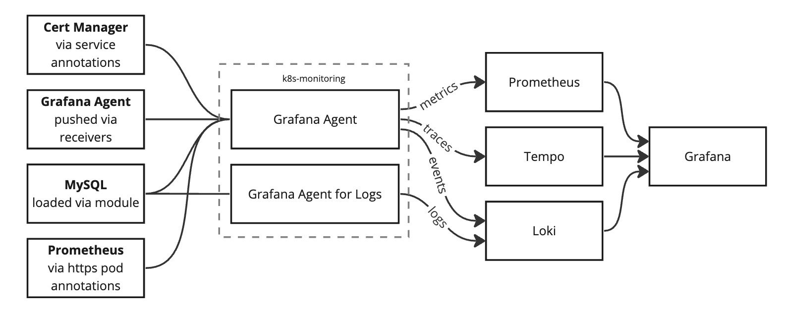

# CI values files

Any files that are named `*-values.yaml` will be used for testing.

-   `ci-values.yaml`
    -   Default tests
    -   Control plane metrics
    -   Extra test queries
-   `ci-2-values.yaml`
    -   Sending metrics, logs, and traces via OTLP HTTP
    -   Pod logs gathered via K8s API and PodLogs objects
    -   Filtering pod logs by namespace
    -   Custom test queries, including LogQL and TraceQL queries
-   `ci-integrations-values.yaml`
    -   Loading integrations via modules
    -   Loading integrations via Pod annotations (and over https)
    -   Loading integrations via Service annotations

## Architecture

The CI/CD test environment is deployed out like this:

-   Telemetry Sources
    -   Cert Manager, used for testing discovery using service annotations
    -   Grafana Alloy, used for pushing metrics and traces using receivers
    -   MySQL, used for testing module integrations
    -   Prometheus, used for testing discovery using pod annotations and https
    -   Loki, used for testing discovery using ServiceMonitor objects
    -   Grafana, used for gathering logs via a PodLogs object
    -   The rest of Kubernetes
-   Subject under test
    -   k8s-monitoring helm chart, which deploys its own set of Grafana Alloy instances
-   Data storage
    -   Prometheus
    -   Loki
        -   Another Grafana Alloy instance, which accepts logs via OTLP, translates to Loki and writes to this Loki service
    -   Tempo
-   Data visualization
    -   Grafana
