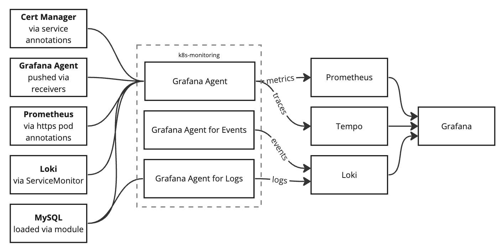

# CI values files

Any files that are named `*-values.yaml` will be used for testing.

* `ci-values.yaml`
  * Default tests
  * Control plane metrics
  * Extra test queries
* `ci-2-values.yaml`
  * Sending metrics via OTLP HTTP
  * Sending traces via OTLP HTTP
  * Filtering pod logs by namespace
  * Custom test queries, including LogQL and TraceQL queries
* `ci-integrations-values.yaml`
  * Loading integrations via modules
  * Loading integrations via Pod annotations (and over https)
  * Loading integrations via Service annotations

## Architecture

The CI/CD test environment is deployed out like this:

* Telemetry Sources
  * Cert Manager, used for testing discovery using service annotations
  * Grafana Agent, used for pushing metrics and traces using receivers
  * MySQL, used for testing module integrations
  * Prometheus, used for testing discovery using pod annotations and https
  * The rest of Kubernetes
* Subject under test
  * k8s-monitoring helm chart, which deploys its own set of Grafana Agents
* Data storage
  * Prometheus
  * Loki
  * Tempo
* Data vizualization
  * Grafana
