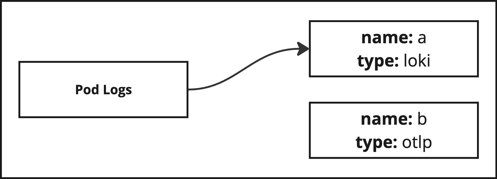
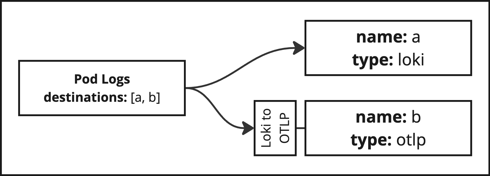
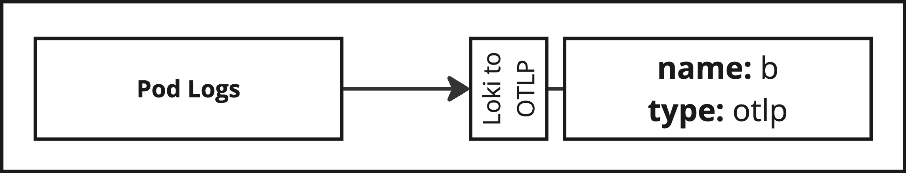

# Destinations

Destinations are where telemetry data will be delivered. It can be a local service deployed on the same cluster, or a
remote, SaaS service. The different destination types actually about the protocol that is used to deliver that data.

| Type         | Protocol         | Telemetry Data        | Docs                    |
|--------------|------------------|-----------------------|-------------------------|
| `prometheus` | Remote Write     | Metrics               | [Docs](./prometheus.md) |
| `loki`       | Loki             | Logs                  | [Docs](./loki.md)       |
| `otlp`       | OTLP or OTLPHTTP | Metrics, Logs, Traces | [Docs](./otlp.md)       |
| `pyroscope`  | Pyroscope        | Profiles              | [Docs](./pyroscope.md)  |

## Configuration

You can specify multiple destinations in the `destinations` section of the configuration file. Each destination must
have a name and a type. The type determines the protocol that will be used to deliver the telemetry data.

## What about Tempo?

There is no `tempo` destination for traces, because [Tempo](https://grafana.com/oss/tempo/) uses the OTLP protocol to
receive traces. So, you can use the `otlp` destination to send traces to Tempo.

## Example

Here is an example of a destinations section:

```yaml
destinations:
  - name: hostedMetrics
    type: prometheus
    url: https://prometheus.example.com/api/prom/push
    auth:
      type: basic
      username: "my-username"
      password: "my-password"

  - name: localPrometheus
    type: prometheus
    url: http://prometheus.monitoring.svc.cluster.local:9090

  - name: hostedLogs
    type: loki
    url: https://loki.example.com/loki/api/v1/push
    auth:
      type: basic
      username: "my-username"
      password: "my-password"
      tenantIdFrom: env("LOKI_TENANT_ID")

  - name: otlpGateway
    type: otlp
    url: https://otlp.example.com:4317/v1/traces
    auth:
      type: basic
      username: "my-username"
      password: "my-password"
    metrics: { enabled: true }
    logs:    { enabled: true }
    traces:  { enabled: true }
```

## Assignment

When there are multiple destinations that support the same type of telemetry data, the Helm chart will try to
intelligently assign data from features to destinations. The assignment algorithm is:

1. Has the feature defined its own `destintaions` list? If so, use that.
2. Assign any destinations to features that are in the same ecosystem.
3. If there are no matching ecosystem destinations, assign any destinations that support the telemetry data type.

Matching ecosystems first is important because it prevents translations between ecosystems, which may be imperfect.

###  Examples

These examples demonstrate how the assignment algorithm works.

#### Example 1

Assume we have a feature that gathers logs in the Loki ecosystem (e.g. via the `loki.source.file` Alloy component).
Next, assume we have defined two destinations: a `loki` type destination, and an `oltp` type destination that supports
logs.

```yaml
destinations:
  - name: a
    type: loki

  - name: b
    type: otlp
    logs:
      enabled: true

podLogs:
  enabled: true
```

The Kubernetes Observability Helm chart will forward logs from the feature to the `loki` destination, because it is in
the same ecosystem. The `otlp` destination will not receive any logs.



#### Example 2

If we explicitly set the list of destinations, we can override the assignment algorithm and send logs to both
destinations. Loki logs will go through a translator component to convert them to the OTLP ecosystem.

```yaml
destinations:
  - name: a
    type: loki

  - name: b
    type: otlp
    logs:
      enabled: true

podLogs:
  enabled: true
  destinations: [a, b]
```



#### Example 3

If only the `otlp` destination is defined, the logs will be sent to that destination without having to be explicitly
defined.

```yaml
destinations:
  - name: b
    type: otlp
    logs:
      enabled: true

podLogs:
  enabled: true
```


