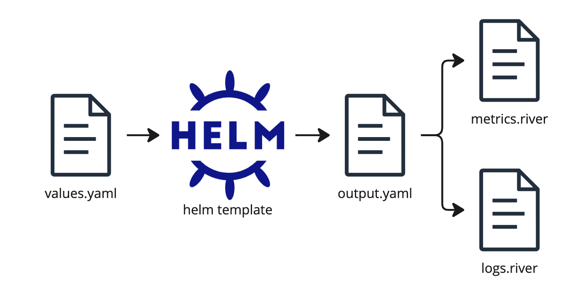

# Examples

This directory contains example inputs and outputs for the Kubernetes Monitoring Helm chart.
These are real examples, not contrived text snippets. They use the chart itself to generate the outputs.

In each example, there is a values.yaml file, which serves as the input for the chart.
Then, `helm template` is used to render the chart to produce `output.yaml`, which is what would be deployed to the
Kubernetes cluster, given that values file.

Then, we extract the Grafana Agent configuration files from the ConfigMap objects and save them as `metrics.river` and
`logs.river`.

## Index of examples

* [Default values](./default-values) - The most basic example.

### Enabling or disabling features

* [Control Plane Metrics](./control-plane-metrics) - Enable gathering metrics from the Kubernetes Control Plane.
* [Logs Only](./logs-only) - Only gather and send logs.
* [Metrics Only](./metrics-only) - Only scrape and send metrics.
* [Profiles Enabled](./profiles-enabled) - Enable gathering and delivery of profiles to Pyroscope.
* [Service Integrations](./service-integrations) - A few methods for gathering telemetry data from other services.
* [Traces Enabled](./traces-enabled) - Enable the OpenTelemetry receiver for traces and send then to Grafana Tempo.
* [Windows Exporter](./windows-exporter) - Enable deployment and scraping of the Windows Exporter for Windows nodes.

### Customizing behavior

* [Agent Autoscaling and Storage](./agent-autoscaling-and-storage) - Enable Autoscaling and storage for the Grafana Agent.
* [Custom Metrics Tuning](./custom-metrics-tuning) - Change which metrics are send to Prometheus.
* [Custom Configs](./custom-config) - Add arbitrary Grafana Agent Flow components to the configuration.
* [Kube Pod Labels](./kube-pod-labels) - Change configuring kube-state-metrics deployment and scraping config to allow Pod label metrics.
* [Extra Rules](./extra-rules) - Add extra rules and stages for discovering and processing metrics and logs.
* [OpenTelemetry services](./otel-metrics-service) - Change the delivery of metrics to use the OTLP or OTLPHTTP protocol.
* [Private Image Registries](./private-image-registry) - Utilize other image registries for the images deployed by this Helm chart. 
* [Proxies](./proxies) - Using Proxies to access the external services.
* [Scrape Intervals](./scrape-intervals) - Customize how often to scrape metrics.
* [Specific Namespace](./specific-namespace) - Only gather metrics and logs from workloads in specific namespaces.

### Specific platform examples

* [EKS on Fargate](./eks-fargate) - Compatible with AWS EKS on Fargate Clusters.
* [GKE Autopilot](./gke-autopilot) - Compatible with Google GKE Autopilot Clusters.
* [IBM Cloud](./ibm-cloud) - Compatible with IBM Cloud Clusters.
* [OpenShift Compatible](./openshift-compatible) - Compatible with OpenShift Clusters.
